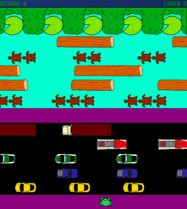

# FrogTown

Frog Town is an action game based on the 1981 arcade classic title Frogger.  

You can play a live version of the game [here](https://shanp77.github.io/FrogQuest/dist/index.html)



## Technologies:

- HTML5
- HTML5 Canvas
- Javascript

## Instructions

The goal is to navigate the frog across the street and river, to one of the 5 "homes" at the top of the screen.  You must avoid being hit by the cars while crossing the street.  The frog hops onto the floating logs and turtles, hopping from floating object to object, finally landing in one of the 5 home spots.  You must avoid landing in the water.  Once a frog has successfully been placed in all 5 home spots, the level is complete.

### Controls

Move Left: left arrow
Move Right: right arrow
Move Up: up arrow
Move Down: down arrow

## Technical Details and Highlights

Rendered in HTML5's Canvas 2D graphics rendering element. Javascript source code compiled with Webpack. The Animation loop is managed utilizing Canvas' requestAnimationFrame() recursive function, for delivering smooth animations at 60fps, waiting for the Browser to be available before rendering the animation frame.

Frog movement animation frames are timed to be synchronized with the overall progression of the frog within it's movement.  As the frog's location changes, so does the frame.

To handle direction changes of the frog sprite, the canvas is rotated x degrees, starting at the center point of the sprite.  The sprite is drawn and then the canvas position is restored to its original position.

## Code Snippet


#### MovingObject.js

```
draw(ctx) {
    if(this instanceof Frog) {
      let img = new Image();
      if(this.isHit) {
        img.src = '';
      } else {
        img.src = this.image1;
        if (this.stopPos) {
          img = this.getAnimationFrame();
        }
      }
      
      
      // get center point coords for current grid square
      let centerPoint = [this.pos[0] + 0.5 * this.width, this.pos[1] + 0.5 * this.height];
      
      ctx.save();
      // change direction of the frog by rotating the canvas
      ctx.translate(centerPoint[0], centerPoint[1]);
      let degrees = this.rotationDegrees();
      ctx.rotate(Math.PI/180 * degrees);
      ctx.drawImage(img, -(0.5 * img.naturalWidth), -(0.5 * img.naturalHeight));


      // aftr drawing frog, rotate canvas back to original position
      ctx.restore();
      
      return;
    } else {
      ctx.fillStyle = this.color;
      if(this.image && this.type !== "turtles-2" && this.type !=="turtles-3") {
        
        ctx.drawImage(this.img, this.pos[0], this.pos[1]);
      } else if (this.image && (this.type === "turtles-3" || this.type === "turtles-2")) {
        
          // ctx.drawImage(this.img, this.pos[0], this.pos[1]);
          // ctx.drawImage(this.img, this.pos[0] + 40, this.pos[1]);
        let frame = (Math.round(this.tick / 5)) % 7;
        //this.y = this.calculateYStart(this.animationFrames[frame].height);

        ctx.drawImage(this.animationFrames[frame], this.pos[0], this.pos[1]);
        ctx.drawImage(this.animationFrames[frame], this.pos[0] + 40, this.pos[1]);
        
        if (this.type === "turtles-3") ctx.drawImage(this.animationFrames[frame], this.pos[0] + 80, this.pos[1]);
        this.tick += 1;
        } else {
        ctx.beginPath();
        ctx.fillRect(this.pos[0],this.pos[1],this.width,this.height); 
        ctx.fill();
      }
    }
  }

getAnimationFrame() {
    let axis = null;
    if(this.moveDir === "left" || this.moveDir === "right" ) {
      axis = 0;
    } else {
      axis = 1;
    }
    let frameUnits = this.game.grid / this.animationFrames.length;
    let progress = Math.abs(this.startPos[axis] - this.pos[axis]);
  
    let frame = Math.floor(progress / frameUnits) % this.animationFrames.length;
    return this.animationFrames[frame];
  }
```

## Creator

#### Shannon Piesinger
